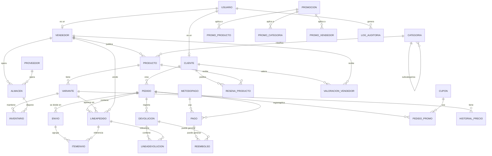

```mermaid
erDiagram
    USUARIO ||--o| CLIENTE : "es un"
    USUARIO ||--o| VENDEDOR : "es un"

    VENDEDOR ||--o{ PRODUCTO : "publica"
    CATEGORIA ||--o{ CATEGORIA : "subcategoriza"
    CATEGORIA ||--o{ PRODUCTO : "clasifica"
    PRODUCTO  ||--o{ VARIANTE : "tiene"

    VENDEDOR  ||--o{ ALMACEN : "opera"
    PROVEEDOR ||--o{ ALMACEN : "opera"
    VARIANTE  ||--o{ INVENTARIO : "mantiene"
    ALMACEN   ||--o{ INVENTARIO : "dispone"

    CLIENTE ||--o{ PEDIDO : "crea"
    PEDIDO  ||--o{ LINEAPEDIDO : "contiene"
    VARIANTE ||--o{ LINEAPEDIDO : "aparece en"
    VENDEDOR ||--o{ LINEAPEDIDO : "vende"

    PEDIDO ||--o{ ENVIO : "se divide en"
    ENVIO  ||--o{ ITEMENVIO : "agrupa"
    LINEAPEDIDO ||--o{ ITEMENVIO : "referencia"

    METODOPAGO ||--o{ PAGO : "usa"
    PEDIDO     ||--o{ PAGO : "registra"
    PAGO       ||--o{ REEMBOLSO : "puede generar"
    PEDIDO     ||--o{ DEVOLUCION : "registra"
    DEVOLUCION ||--o{ LINEADEVOLUCION : "contiene"
    LINEAPEDIDO ||--o{ LINEADEVOLUCION : "referencia"
    DEVOLUCION ||--o{ REEMBOLSO : "puede generar"

    PROMOCION ||--o{ PROMO_PRODUCTO : "aplica a"
    PROMOCION ||--o{ PROMO_CATEGORIA : "aplica a"
    PROMOCION ||--o{ PROMO_VENDEDOR : "aplica a"
    PEDIDO    ||--o{ PEDIDO_PROMO : "aplica"
    CUPON     ||--o{ PEDIDO_PROMO : "usa"

    CLIENTE  ||--o{ RESENA_PRODUCTO : "publica"
    PRODUCTO ||--o{ RESENA_PRODUCTO : "recibe"
    CLIENTE  ||--o{ VALORACION_VENDEDOR : "valora"
    VENDEDOR ||--o{ VALORACION_VENDEDOR : "recibe"

    VARIANTE ||--o{ HISTORIAL_PRECIO : "tiene"
    USUARIO  ||--o{ LOG_AUDITORIA : "genera"
```