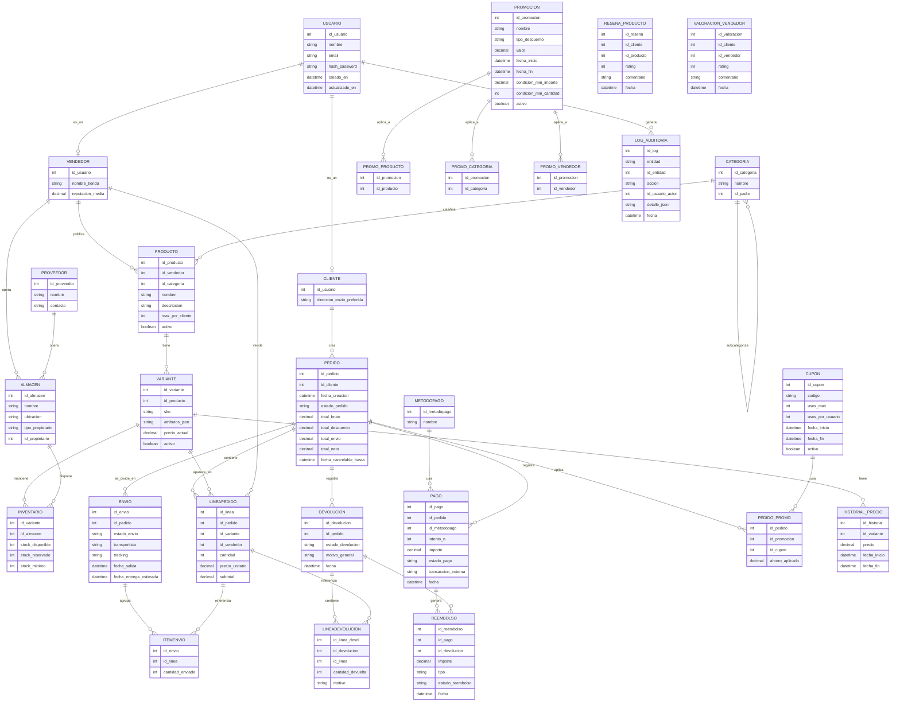

```mermaid
erDiagram
  USUARIO {
    int id_usuario
    string nombre
    string email
    string hash_password
    datetime creado_en
    datetime actualizado_en
  }

  CLIENTE {
    int id_usuario
    string direccion_envio_preferida
  }

  VENDEDOR {
    int id_usuario
    string nombre_tienda
    decimal reputacion_media
  }

  CATEGORIA {
    int id_categoria
    string nombre
    int id_padre
  }

  PRODUCTO {
    int id_producto
    int id_vendedor
    int id_categoria
    string nombre
    string descripcion
    int max_por_cliente
    boolean activo
  }

  VARIANTE {
    int id_variante
    int id_producto
    string sku
    string atributos_json
    decimal precio_actual
    boolean activo
  }

  PROVEEDOR {
    int id_proveedor
    string nombre
    string contacto
  }

  ALMACEN {
    int id_almacen
    string nombre
    string ubicacion
    string tipo_propietario
    int id_propietario
  }

  INVENTARIO {
    int id_variante
    int id_almacen
    int stock_disponible
    int stock_reservado
    int stock_minimo
  }

  PEDIDO {
    int id_pedido
    int id_cliente
    datetime fecha_creacion
    string estado_pedido
    decimal total_bruto
    decimal total_descuento
    decimal total_envio
    decimal total_neto
    datetime fecha_cancelable_hasta
  }

  LINEAPEDIDO {
    int id_linea
    int id_pedido
    int id_variante
    int id_vendedor
    int cantidad
    decimal precio_unitario
    decimal subtotal
  }

  ENVIO {
    int id_envio
    int id_pedido
    string estado_envio
    string transportista
    string tracking
    datetime fecha_salida
    datetime fecha_entrega_estimada
  }

  ITEMENVIO {
    int id_envio
    int id_linea
    int cantidad_enviada
  }

  METODOPAGO {
    int id_metodopago
    string nombre
  }

  PAGO {
    int id_pago
    int id_pedido
    int id_metodopago
    int intento_n
    decimal importe
    string estado_pago
    string transaccion_externa
    datetime fecha
  }

  DEVOLUCION {
    int id_devolucion
    int id_pedido
    string estado_devolucion
    string motivo_general
    datetime fecha
  }

  LINEADEVOLUCION {
    int id_linea_devol
    int id_devolucion
    int id_linea
    int cantidad_devuelta
    string motivo
  }

  REEMBOLSO {
    int id_reembolso
    int id_pago
    int id_devolucion
    decimal importe
    string tipo
    string estado_reembolso
    datetime fecha
  }

  PROMOCION {
    int id_promocion
    string nombre
    string tipo_descuento
    decimal valor
    datetime fecha_inicio
    datetime fecha_fin
    decimal condicion_min_importe
    int condicion_min_cantidad
    boolean activo
  }

  CUPON {
    int id_cupon
    string codigo
    int usos_max
    int usos_por_usuario
    datetime fecha_inicio
    datetime fecha_fin
    boolean activo
  }

  PROMO_PRODUCTO {
    int id_promocion
    int id_producto
  }

  PROMO_CATEGORIA {
    int id_promocion
    int id_categoria
  }

  PROMO_VENDEDOR {
    int id_promocion
    int id_vendedor
  }

  PEDIDO_PROMO {
    int id_pedido
    int id_promocion
    int id_cupon
    decimal ahorro_aplicado
  }

  RESENA_PRODUCTO {
    int id_resena
    int id_cliente
    int id_producto
    int rating
    string comentario
    datetime fecha
  }

  VALORACION_VENDEDOR {
    int id_valoracion
    int id_cliente
    int id_vendedor
    int rating
    string comentario
    datetime fecha
  }

  HISTORIAL_PRECIO {
    int id_historial
    int id_variante
    decimal precio
    datetime fecha_inicio
    datetime fecha_fin
  }

  LOG_AUDITORIA {
    int id_log
    string entidad
    int id_entidad
    string accion
    int id_usuario_actor
    string detalle_json
    datetime fecha
  }

  USUARIO ||--o| CLIENTE : es_un
  USUARIO ||--o| VENDEDOR : es_un
  CATEGORIA ||--o{ CATEGORIA : subcategoriza
  VENDEDOR  ||--o{ PRODUCTO : publica
  CATEGORIA ||--o{ PRODUCTO : clasifica
  PRODUCTO  ||--o{ VARIANTE : tiene
  VENDEDOR  ||--o{ ALMACEN : opera
  PROVEEDOR ||--o{ ALMACEN : opera
  VARIANTE  ||--o{ INVENTARIO : mantiene
  ALMACEN   ||--o{ INVENTARIO : dispone
  CLIENTE   ||--o{ PEDIDO : crea
  PEDIDO    ||--o{ LINEAPEDIDO : contiene
  VARIANTE  ||--o{ LINEAPEDIDO : aparece_en
  VENDEDOR  ||--o{ LINEAPEDIDO : vende
  PEDIDO    ||--o{ ENVIO : se_divide_en
  ENVIO     ||--o{ ITEMENVIO : agrupa
  LINEAPEDIDO ||--o{ ITEMENVIO : referencia
  METODOPAGO ||--o{ PAGO : usa
  PEDIDO    ||--o{ PAGO : registra
  PAGO      ||--o{ REEMBOLSO : genera
  PEDIDO    ||--o{ DEVOLUCION : registra
  DEVOLUCION ||--o{ LINEADEVOLUCION : contiene
  LINEAPEDIDO ||--o{ LINEADEVOLUCION : referencia
  DEVOLUCION ||--o{ REEMBOLSO : genera
  PROMOCION ||--o{ PROMO_PRODUCTO : aplica_a
  PROMOCION ||--o{ PROMO_CATEGORIA : aplica_a
  PROMOCION ||--o{ PROMO_VENDEDOR : aplica_a
  PEDIDO    ||--o{ PEDIDO_PROMO : aplica
  CUPON     ||--o{ PEDIDO_PROMO : usa
  VARIANTE  ||--o{ HISTORIAL_PRECIO : tiene
  USUARIO   ||--o{ LOG_AUDITORIA : genera
```